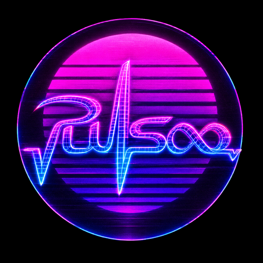

  

<h1 align="center">Puls8</h1>

<b>Companion plugin for Puls8, a rooftop lounge and pool on Raiden.</b> 
Lavender Beds · Ward 7 · Plot 16 · <a href="https://discord.gg/puls8">discord.gg/puls8</a>

## Install

1. `/xlsettings` → **Experimental** → **Custom Plugin Repositories**
2. Add `https://raw.githubusercontent.com/IttoJinrah/puls8/main/repo.json`, tick **Enabled**, **Save**
3. Install **Puls8** from `/xlplugins`, then type `/puls`

## Features

- **Travel:** one tap to the club through Lifestream
- **Events:** opening hours in your time zone, upcoming nights, reminders
- **Wifi:** venue syncshell (Lightless) and ZoneSync (PlayerSync)
- **Mods:** installs and updates the Puls8 Penumbra packs for you

Commands: `/puls`, `/puls travel`, `/puls events`, `/puls wifi`, `/puls mods`

## Credits

**Arka** (original plugin) · **XeldarAlz** (plugin overhaul, UI design, mod installer, travel and wifi)
